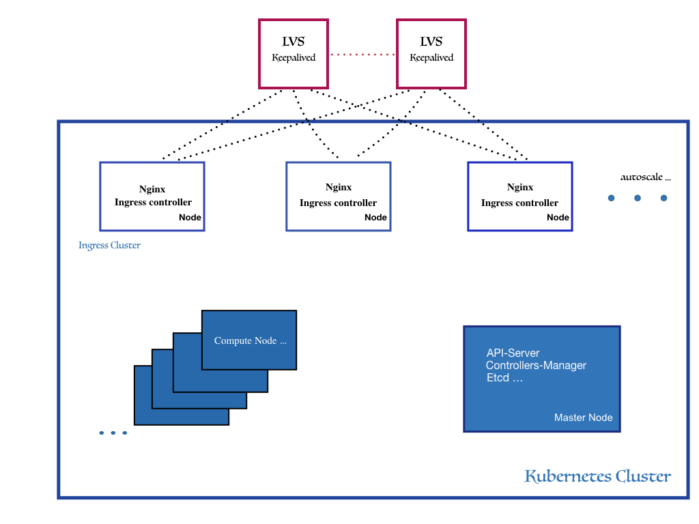

# IPVS based kubernetes controller

This project is aimed to provide external traffic loadbalancing to kubernetes based container application.
Especially for heavy traffic loads mode.

It currently works only in DR mode, we shall setup ingress-nginx-controllers in HostNetwork mode as 'realserver' of a pair of LVS.
ingress-nginx-controller and its tcp/udp configmaps should be created in a specific namespace
and we can scale out nginx using HPA in heavy traffic mode.

external traffics will direct from lvs to ingress-nginx-controller then to endpoint service.

# High level Architecture

### Adavantages of the architecture
This architecture first offers a Front entrypoint for ipv4 for L7 ingress traffic, ingress-nginx-controller itself will expose node ip in public which is not good for security,
besides, It implements the scalability (HA) of ingress-nginx-controllers, as LVS is the only entrypoint of the cluster.

Second, we can simply config tcp/udp configmaps of ingress-nginx-controller, then the lvs-nginx-controller will update and reload lvs
configs in hot mode. Thus offering L4 TCP/UDP loadbalancing functionnalities.

In a very heavy traffic situation, we can also deploy several lvs pairs in Front for different application services.

This architecture avoids the vulnerability of traditinnal NodePort mode, as it exposes ports in every nodes, which may be
good in cloud environ, but could definitly be security dangerous in bare-metal environment.

### Running
In order to make it works, we need to config nodes running ingress-nginx-controller according scripts in dir install.

to debug and print gc logs, run:
GODEBUG='gctrace=1' ./lvs-controller --debug --kubeconfig kubeconfig -vip 10.135.22.77 --schedname rr 2>&1>gc.log &
